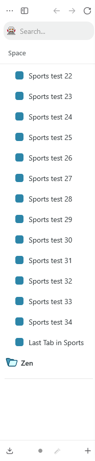
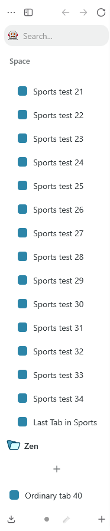

# Ordinary tabs disappearing below a large pinned folder

With **Keep pinned tabs at the top when scrolling** enabled, expanding a large
pinned folder could make the ordinary tabs below it impossible to reach.
Collapsing the folder brought them back. The tabs were still there; their
section had been squeezed to zero height.

These screenshots show the same disposable profile and the same 700 × 900
window, scrolled to the bottom of Sports. Only SuperPins is loaded. All 78 tabs
are present in both captures.

| SuperPins 1.7.2                                                                                  | With this fix                                                                                                  |
| ------------------------------------------------------------------------------------------------ | -------------------------------------------------------------------------------------------------------------- |
|  |  |

The ordinary section measures **0 px before** and **80 px after** at this tab
density. Each section can be scrolled to its last tab. For comparison, here is
[the original version with Sports collapsed](images/tall-folder-collapsed.png),
where the ordinary tabs are visible again.

## What changed

Short pinned sections keep their natural height. When a folder gets too tall,
the pinned section can shrink and scroll, leaving room for the New Tab row and
an ordinary tab below it. The minimum uses Zen's tab dimensions rather than a
fixed share of the sidebar.

CSS alone was not enough in the tested Gecko build. The native arrowscrollbox
has a shadow slot whose minimum height also needs to shrink. A small Sine
module applies that rule at author origin, keeps keyboard-selected and focused
tabs visible, and supports drag scrolling at the pinned section's edges. Zen
still handles selection, grouping and dropping. The module shares its input
listeners with the corresponding New Tab Button repair and removes them when
the last mod using them unloads.

The existing SuperPins settings and orientation script are preserved. The fix
also respects scrollbar hiding and handles legacy grid layout's important
overflow rule. It changes no saved tabs, titles, folders or preferences. Both
the stylesheet and the script are needed, so Sine must be allowed to run the
included JavaScript.

## Testing

The original failure reproduced on **Zen 1.22.3b / Gecko 156.0.1**. The repair
was checked with SuperPins alone, the corrected New Tab Button alone, and both
stylesheet orders, across three window heights and both sidebar modes: 24
layout cases. Sine unload/reload, preference changes, workspace changes,
cold-start loading and scrollbar hiding were checked separately.

Visible-window checks covered wheel scrolling, New Tab actions and keyboard
navigation. Manual drags successfully reordered tabs in both sections, and
both last tabs could be reached. The automated pointer test did not produce
native drop events even without the mods, so it is not counted as a passing
drag test.

A temporary trial in the everyday profile also restored access to the ordinary
tabs. All 61 tab identities and the checked folder/preference state were
preserved, and the user confirmed the behavior was correct. That was an
in-memory trial; the published package has not been permanently installed there.

The generated package was then checked in the disposable profile for the
screenshots above. A separate legacy-grid check caught an overflow conflict:
before correcting it, wheel input did not scroll the pinned section; afterward
it scrolled by 292 px, while the ordinary section kept its 80 px viewport. The
first and last tabs in both sections remained reachable.

To build the module and run its input/lifecycle tests:

```sh
bun install --frozen-lockfile
bun run build
node --test test-superpins.mjs
```

The Bun 1.3.12 build, all 12 Node tests, ESLint, the changed CSS's Stylelint
check, formatting checks and the new module's strict TypeScript check pass.
Repository-wide `tsc --noEmit` still reports three existing errors in
`scripts/build.ts`, where `entry.split(sep)[0]` can be undefined. The build script
is unchanged. The Node tests check module behavior; they do not simulate Gecko
layout.

Two limits matter here. An Essentials grid that is taller than the available
window is a separate problem. Also, Even Better New Tab Button 1.0.3's sticky
rules can cause the same collapse independently, so that mod needs its own fix
when both are installed. The native-only fixture did not reproduce this defect.

## Using the fork and rolling back

The mod keeps its existing identity and preferences. Replace the existing
SuperPins package when switching to the fork; do not install a second copy.
Keep the old package and its Sine source entry so they can be restored together.
Tabs and preferences need no migration. Unloading the mod removes its runtime
changes, and restarting also clears them.
